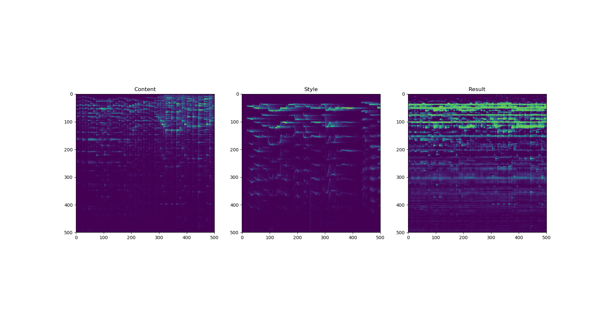

# Neural-Style-Transfer-Audio

This is PyTorch Implementation Of Neural Style Transfer Algorithm which is modified for Audios.  

# Aim - 

Aimed to analyze and mix two audios in order to synthesize new music, we do this by applying Neural Style Transfer on two Audios to transfer style of a style audio on a content audio.

# Dependencies - 

  1. python 3.9
	
  2. PyTorch 
	
  3. librosa
	
  4. numpy and matplotlib.
	
# How to run -

  The algorithm is implemented in PyTorch which can run on both GPU and CPU.
		
  To run: python NeuralStyleTransfer.py { ContentAudio } { StyleAudio }
		
  Output Format(Name Of Output File) : output1D_(no of filters)_iter(no of iterations)_c(content audio)_s(style audio)_sw(style weight)_k(kernel size)_s(stride)_p(padding).wav
		[For changing name: Change k, s and p manually]
		
  A Sample Output is also provided with alpha.wav as content and beta.wav as style.
  
# How to plot graph-

  To plot: python graphs.py [Content Audio file name] [Style Audio file name] [Output File name]

# Problems Faced -

  1. Library for loading Audio files -
	  
	  * To load audio files librosa should be used instead of audiolab because lirosa has more features to manipulate and analyze audio files.

  2. Preprocessing -

	  * While working with audio files, the feature to work on is frequency and librosa loads audios as a function of time so fourier transformation is performed on the audio.
	
	  * If we apply Neural style without fourier transformations i.e. on time domain, the output contains a lot of noise and so the audios do not mix properly.

	  * The matrices obtained should not be downscaled beacause it would result in loss of information and also if a channel is dropped it creates an anomaly during inverse fourier transformation.
	  
	  * Duration of audio loaded is kept 58.04 so as to make the matrix sizes convenient.

	  * Matrices should be resized to correct dimensions.
	
	  * Sampling rates should be same.

  3. Model - 

	  * A shallow model should be chosen with a large number of filters.

	  * Pooling should be avoided as it increases the computations(slowing down our model) and also results in loss of information.

	  * 1D convolutions should be used instead of 2D convolutions because each frequency has it's own samples which should not be interlinked with samples of other frequencies and also it causes unnecessary noise.

  4. Loss Function and Optimizer - 

	  * Only style loss is considered and not the content loss.
	
	  * Adam optimizer is used but other optimizers can be used as well.

  5. Training - 

	  * The input audio should be the content audio and not a random white noise.

	  * Number of steps must be chosen carefully (400 is fine).

  6. Final output - 

	  * Once the final output is obtained phase reconstruction should be done.

# References - 

  1. Original Paper on Neural Style Transfer : https://arxiv.org/abs/1508.06576
	
  2. Blog by Dmitry Ulynov : https://dmitryulyanov.github.io/audio-texture-synthesis-and-style-transfer/
	
  3.  Advanced Pytorch Tutorial for Neural Style Transfer : http://pytorch.org/tutorials/advanced/neural_style_tutorial.html#sphx-glr-advanced-neural-style-tutorial-py
  
  4. Paper on Audio Style Transfer By Eric Grinstein, Ngoc Duong, Alexey Ozerov, Patrick Perez : https://arxiv.org/abs/1710.11385
  